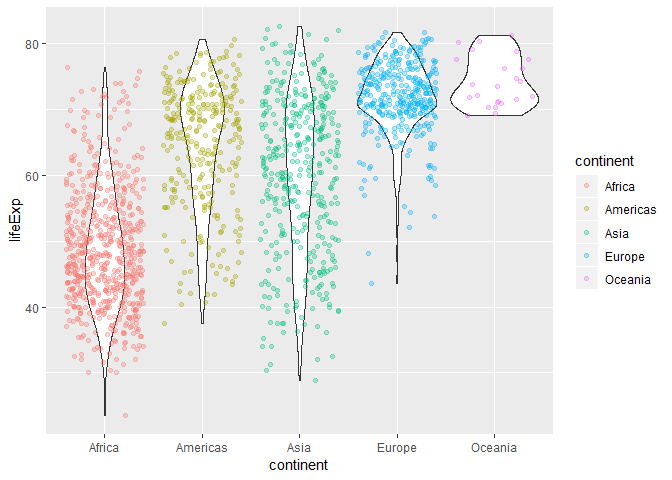

Exploring gapminder using dplyr and ggplot2
================

In this document, we will be exploring the gapminder dataset using (among other tools) the `dplyr` and `ggplot` functions. First we load the gapminder dataset and the tidyverse package.

``` r
#load gapminder and tidyverse
library(gapminder)
library(tidyverse)
```

    ## -- Attaching packages -------------------------------------------------------------------------- tidyverse 1.2.1 --

    ## v ggplot2 3.0.0     v purrr   0.2.5
    ## v tibble  1.4.2     v dplyr   0.7.6
    ## v tidyr   0.8.1     v stringr 1.3.1
    ## v readr   1.1.1     v forcats 0.3.0

    ## -- Conflicts ----------------------------------------------------------------------------- tidyverse_conflicts() --
    ## x dplyr::filter() masks stats::filter()
    ## x dplyr::lag()    masks stats::lag()

Smell test the data
-------------------

In this section we determine some basic attributes of `gapminder`.

-   Is it a data.frame, a matrix, a vector, a list?

``` r
#We can use the is.[datatype] to determine what gapminder is
is.data.frame(gapminder)
```

    ## [1] TRUE

``` r
is.matrix(gapminder)
```

    ## [1] FALSE

``` r
is.vector(gapminder)
```

    ## [1] FALSE

``` r
is.list(gapminder)
```

    ## [1] TRUE

We see that `gapminder` is a data.frame and a list, but it is not a matrix or a vector.

-   What is its class?

``` r
class(gapminder)
```

    ## [1] "tbl_df"     "tbl"        "data.frame"

We see that `gapminder` is a `data.frame`, a tibble (`tbl`), and a tibble dataframe (`tbl_df`).

-   How many variables/columns?

``` r
ncol(gapminder)
```

    ## [1] 6

-   How many rows/observations?

``` r
nrow(gapminder)
```

    ## [1] 1704

-   Can you get these facts about “extent” or “size” in more than one way? Can you imagine different functions being useful in different contexts?

We can determine both the class and the number of rows & columns (among other information) of `gapminder` another way by using, for example, the `str` function,

``` r
str(gapminder)
```

    ## Classes 'tbl_df', 'tbl' and 'data.frame':    1704 obs. of  6 variables:
    ##  $ country  : Factor w/ 142 levels "Afghanistan",..: 1 1 1 1 1 1 1 1 1 1 ...
    ##  $ continent: Factor w/ 5 levels "Africa","Americas",..: 3 3 3 3 3 3 3 3 3 3 ...
    ##  $ year     : int  1952 1957 1962 1967 1972 1977 1982 1987 1992 1997 ...
    ##  $ lifeExp  : num  28.8 30.3 32 34 36.1 ...
    ##  $ pop      : int  8425333 9240934 10267083 11537966 13079460 14880372 12881816 13867957 16317921 22227415 ...
    ##  $ gdpPercap: num  779 821 853 836 740 ...

which also displays the classes of gapminder and the number of rows & columns.

-   What data type is each variable?

From above, we read off that *continent* and *country* are of `factor` type, *year* and *population* are `integer`, and *life expectancy* and *Gdp per capita* are `numbers`.

Exploring a variable
--------------------

-   What are possible values (or range, whichever is appropriate) of each variable? For continent, population, and lifeExp, we have

``` r
#picks out the distinct continents from the continent column in gapminder
distinct(select(gapminder, continent))
```

    ## # A tibble: 5 x 1
    ##   continent
    ##   <fct>    
    ## 1 Asia     
    ## 2 Europe   
    ## 3 Africa   
    ## 4 Americas 
    ## 5 Oceania

``` r
#finds the numerical range of the chosen numerical column
range(select(gapminder, pop))
```

    ## [1]      60011 1318683096

``` r
range(select(gapminder, lifeExp))
```

    ## [1] 23.599 82.603

-   What values are typical? What’s the spread? What’s the distribution? Etc., tailored to the variable at hand.

We can use the summary function to give basic statistical information about the population and life expectancy

``` r
#select the population and life expectancy columns of gapminder and give a summary of them 
gapminder %>% 
  select(pop, lifeExp) %>% 
  summary()
```

    ##       pop               lifeExp     
    ##  Min.   :6.001e+04   Min.   :23.60  
    ##  1st Qu.:2.794e+06   1st Qu.:48.20  
    ##  Median :7.024e+06   Median :60.71  
    ##  Mean   :2.960e+07   Mean   :59.47  
    ##  3rd Qu.:1.959e+07   3rd Qu.:70.85  
    ##  Max.   :1.319e+09   Max.   :82.60

For example, the typical life expectancy is around 60 years old.

Plots
-----

Let's explore population visually, using a log-scale histogram.

``` r
#plot population histogram scaled according to density, and plot density on top
ggplot(gapminder, aes(pop)) +
  scale_x_log10() +
  geom_histogram(aes(y=..density..), fill = "green") +
  geom_density()
```

    ## `stat_bin()` using `bins = 30`. Pick better value with `binwidth`.


Next, let's see how population varies with life expectancy across the five continents.

``` r
#plots population on a log scale as a function of life expectancy for each continent
ggplot(gapminder, aes(lifeExp,pop))+
  geom_point(aes(colour=continent), alpha = 0.2) +
  scale_y_log10() +
  facet_wrap(~ continent)
```


We see that in all continents and all countries in those continents, there appears to be a linear relation between population and life expectancy.

Here is a violin plot overlayed with a jitter plot for life expectancy across continents:

``` r
#select continent and life expectancy
gapminder %>% 
  select(continent, lifeExp) %>% 
  #plot violin and jitter plots, colouring by continent
  ggplot(aes(continent, lifeExp)) +
  geom_violin() +
  geom_jitter(aes(colour = continent), alpha = 0.3)
```



In the following, we would like to see a comparison between rate of population growth over the years in Canada, Australia, and New Zealand.

``` r
#filter gapminder according to Oceania and Canada
gapminder %>% 
  filter(continent == "Oceania" | country == "Canada") %>% 
  #select country year and population
  select(country, year,  pop) %>% 
  #plot population of each country on a log scale as a function of year, and make a linear fit
  ggplot(aes(year, pop, shape = country)) +
  scale_y_log10() +
  geom_point() +
  geom_smooth(method ="lm")
```


Visually we estimate from the linear regression fit that the populations of Australia and Canada were increasing at about the same rate, while the population in New Zealand was increasing at a slightly slower rate.

But I want to do more!
----------------------

For people who want to take things further.

Evaluate this code and describe the result. Presumably the analyst’s intent was to get the data for Rwanda and Afghanistan. Did they succeed? Why or why not? If not, what is the correct way to do this?

`filter(gapminder, country == c("Rwanda", "Afghanistan"))`

The output for this code is a 12 x 6 tibble. This code did not succeed in obtaining all the data for Rwanda and Afghanistan. It looks like what this code is doing is **checking equality two rows at a time** therefore missing half the data. For instance for the Rwanda years 1952 & 1957, it will check equality with`Rwanda` and `Afghanistan`, respectively. The Rwanda 1952 row will be evaluated as `true`, but the Rwanda 1957 row will be evaluated as `false` since it is compared to `Afghanistan`.

The following code is a correct way to obtain all the data.

``` r
gapminder %>% 
filter(country == "Rwanda" | country == "Afghanistan")
```

Further fun with dplyr
----------------------

Some other commands which are useful in `dplyr` include the `rename` and `pull` command. The `pull` command allows to extract a single column as a vector.

``` r
gapminder %>% 
  pull(lifeExp)
```

The `rename` command as suggested allows you to rename columns.

``` r
#create new data.frame called gpmdr that has a renamed column "NewName""
gpmdr <- gapminder %>% 
  rename("NewName"= "lifeExp")
```

The `mutate` command allows you to create new variable from existing ones and add it to the data.frame.

``` r
#Add a new column "lifeExp_with_chocolate_cake" to gapminder
gapminder %>% 
  mutate(lifeExp_with_chocolate_cake = lifeExp + 20)
```

    ## # A tibble: 1,704 x 7
    ##    country   continent  year lifeExp     pop gdpPercap lifeExp_with_choco~
    ##    <fct>     <fct>     <int>   <dbl>   <int>     <dbl>               <dbl>
    ##  1 Afghanis~ Asia       1952    28.8  8.43e6      779.                48.8
    ##  2 Afghanis~ Asia       1957    30.3  9.24e6      821.                50.3
    ##  3 Afghanis~ Asia       1962    32.0  1.03e7      853.                52.0
    ##  4 Afghanis~ Asia       1967    34.0  1.15e7      836.                54.0
    ##  5 Afghanis~ Asia       1972    36.1  1.31e7      740.                56.1
    ##  6 Afghanis~ Asia       1977    38.4  1.49e7      786.                58.4
    ##  7 Afghanis~ Asia       1982    39.9  1.29e7      978.                59.9
    ##  8 Afghanis~ Asia       1987    40.8  1.39e7      852.                60.8
    ##  9 Afghanis~ Asia       1992    41.7  1.63e7      649.                61.7
    ## 10 Afghanis~ Asia       1997    41.8  2.22e7      635.                61.8
    ## # ... with 1,694 more rows
